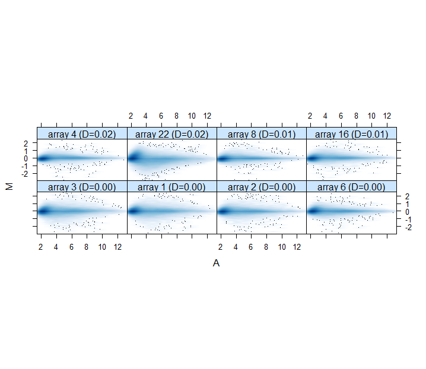
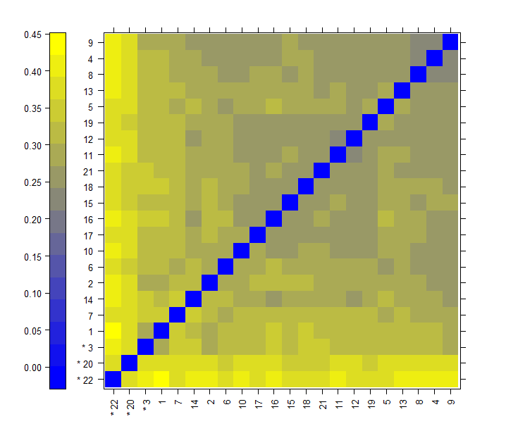

```{r setup, include=FALSE}
require(knitr)
knitr::opts_chunk$set(comment = NA, prompt = TRUE, tidy = FALSE, 
               fig.width = 7, fig.height = 7,echo = TRUE, 
               message = FALSE, warning = FALSE, cache=FALSE)
Sys.setlocale("LC_TIME", "C")

```

```{r packages, eval=FALSE, message=FALSE, warning=FALSE, include=FALSE}
if (!requireNamespace("BiocManager", quietly = TRUE))
  install.packages("BiocManager")
BiocManager::install(version = "3.10")

#Para instalar los paquetes específicos:
BiocManager :: install (c ("Biobase", "methods", "affy", "GEOquery", "simpleaffy", "arrayQualityMetrics","biocLite" ))
BiocManager :: install("pvca")
BiocManager :: install("genefilter")
BiocManager :: install("mas5")
BiocManager :: install("gcrma")
BiocManager :: install("plier")
BiocManager :: install("genefilter")
```

# Análisis de Microarrays

## 0. Abstract

<div style="text-align: justify">

En el experimento analizado se investigaron los patrones de expresión génica relacionados con el sistema inmune en los tejidos del hígado que rodean los tejidos de carcinoma hepatocelular (HCC) en etapa temprana y los agentes quimiopreventivos que podrían alterar estos patrones para prevenir la tumorigénesis hepática. Con ayuda de un analisis de microarrays tratamos de crear clasificaciones, establecer asociaciones con la línea celular de origen y ayudar en el pronóstico, identificando los genes que determinan esa posible clasificación.

El articulo se encuentra en el siguiente enlace:
https://www.ncbi.nlm.nih.gov/pubmed/31344396

## 1.Introducción

La cirrosis y la inflamación crónica preceden el desarrollo del carcinoma hepatocelular (CHC) en aproximadamente el 80% de los casos. Como se ha indicado, se estudian los patrones de expresión génica relacionados con el sistema inmune en los tejidos del hígado que rodean los HCC en etapa temprana y los agentes quimiopreventivos que podrían alterar estos patrones para prevenir la tumorigénesis hepática. Para ello, Se recogieron tejidos hepáticos recién congelados de 22 ratones (3 de control, 9 tratados con vehículo y 10 tratados con nintedanib), y se extrajo el ARN. Los ratones C57BL/6J recibieron una inyección única de N-nitrosodietilamina seguida de dosis semanales de tetracloruro de carbono para inducir fibrosis hepática y tumorigénesis. A los ratones se les dio por vía oral el inhibidor múltiple de tirosina nintedanib o vehículo (controles); Se recolectaron tejidos hepáticos y se realizaron análisis de histología, transcriptoma y proteínas. También analizaron transcriptomes de tejidos hepáticos recolectados de ratones en una dieta alta en grasas con deficiencia de colina, que desarrollaron inflamación hepática crónica y tumores, se les administró aspirina y clopidogrel por vía oral o el agente antiinflamatorio sulindac frente a ratones en una dieta de alimentación (control).

## 2. Objetivos

El objetivo principal que se persigue con el análisis de expresión genética en tumores de ratón es estimar el posible error de clasificación mediante expresión genética de nuevos casos. Trataremos por tanto de responder a la cuestión de encontrar genes diferencialmente expresados entre dos o más condiciones o a lo largo del tiempo y descubrir patrones de expresión característicos.

Los objetivos específicos que se persiguen nos llevan a cubrir un análisis completo de microarrays de expresión genética:

- Control de calidad de microarrays de expresión genética
- Pre procesado de microarrays
- Normalización
- Control de calidad de datos pre-procesados
- Selección de genes diferenciados por expresión
- Clasificación y evaluación de tejidos tumorales por firmas genéticas

## 3. Materiales y Métodos

### 3. 1. Obtención y lectura de datos

Vamos a utilizar los datos libremente disponibles en GEO de un estudio del transcriptoma de *Mus musculus*. Se puede acceder a los datos desde el siguiente link: https://www.ncbi.nlm.nih.gov/geo/query/acc.cgi?acc=GSE125975

El articulo escogido se denomina: *An Immune Gene Expression Signature Associated With Development of Human Hepatocellular Carcinoma Identifies Mice That Respond to Chemopreventive Agents*

**Base de datos**

Se tienen las muestras de ARN de tejidos hepáticos de 22 ratones (3 de control, 9 tratados con vehículo y 10 tratados con nintedanib). El análisis del transcriptoma del genoma completo se obtuvo usando ene Chip HT MG-430 (Affymetrix) de acuerdo con los protocolos del fabricante. [CDF: HTMG430PM_Mm_ENTREZG, Brainarray version 19]

La cantidad total de genes que contiene la base de datos es de 13392 genes en 22 muestras.

Usando placas de microarray de affymetrix HTMG430PM se obtuvieron los siguientes ficheros .CEL

Samples (22)
GSM3587187	QP-4 Control Vehicle
GSM3587188	QP-49 Control Vehicle
GSM3587189	QP-50 Control Vehicle
GSM3587190	QP-76 Model Vehicle
GSM3587191	QP-77 Model Vehicle
GSM3587192	QP-78 Model Vehicle
GSM3587193	QP-79 Model Vehicle
GSM3587194	QP-80 Model Vehicle
GSM3587195	QP-81 Model Vehicle
GSM3587196	QP-92 Model Vehicle
GSM3587197	QP-93 Model Vehicle
GSM3587198	QP-94 Model Vehicle
GSM3587199	QP-82 Model Nintedanib
GSM3587200	QP-83 Model Nintedanib
GSM3587201	QP-84 Model Nintedanib
GSM3587202	QP-85 Model Nintedanib
GSM3587203	QP-86 Model Nintedanib
GSM3587204	QP-87 Model Nintedanib
GSM3587205	QP-88 Model Nintedanib
GSM3587206	QP-89 Model Nintedanib
GSM3587207	QP-90 Model Nintedanib
GSM3587208	QP-91 Model Nintedanib

```{r echo=FALSE}
# Para acceder a GEO Sample (GSM), GEO Series (GSE) (listas de archivos GSM que juntos forman un solo experimento) o GEO Dataset (GDS), empleamos la función getGEO()que devuelve una lista de ExpressionSets.

library(GEOquery)
library(affy)
gset <- getGEO("GSE125975", GSEMatrix =TRUE, AnnotGPL=FALSE)
if (length(gset) > 1) idx <- grep("GPL21382", attr(gset, "names")) else idx <- 1
gset <- gset[[idx]]
fvarLabels(gset) <- make.names(fvarLabels(gset)) # make proper column names to match toptable 

dim(exprs(gset))
pheno.data <- pData(gset)

# tambien podemos obtener los datos RAW. descargando los datos directamente de la pagina a nuestra carpeta de trabajo, despues usamos affy pa leer los datos.

celpath <- "./GSE125975_RAW"
data.raw = ReadAffy(celfile.path=celpath)

# la getGEOSuppFiles() función creará un directorio dentro del directorio de trabajo actual para almacenar los datos sin procesar. Aquí, las rutas de los archivos descargados (a menudo con una extensión .tar) se almacenan en un marco de datos llamado filePaths.

#filePaths = getGEOSuppFiles("GSE125975")
#filePaths

```

Los datos empleados en este estudio, podemos conocerlos más en detalle:

### 3. Pasos llevados a cabo.

## Exploración

En primer lugar realizamos una exploración de los datos con los que trabajamos. Para ello los representamos en varios tipos de graficos. Ademas comprobamos que son comparables entre sí. Podemos analizar la distribución global de la fluorescencia en los distintos microarrays utilizando boxplots (gráficos de cajas) y histogramas usando las funciones *boxplot* y *hist* o *ggplot*

*HISTOGRAMA*

```{r echo=FALSE}
library(reshape)
library(ggplot2)
exprs0 <- exprs(gset)
df = data.frame(gene = featureNames(gset),exprs0)
df1 = melt(df,id=c("gene"))
ggplot(df1,aes(x=value,colour=variable,group=variable)) +
geom_density(kernel = "epanechnikov",fill=NA) ## Estimadores densidad
```

Según la imagen anterior, algunas muestras discrepan de la media. Además la forma extraña que vemos a la derecha, en el value = 5, puede indicar un error sistemático.

*BOXPLOTS*

Podemos ademas representar las muestras en diagramas de cajas o Boxplots, mostrando la distribución de los niveles de expresión a lo largo de las muestras. Como vemos, hay algunas que se desvían del comportamiento general:

```{r echo=FALSE}
ggplot(df1,aes(x=variable,y = value)) + geom_boxplot() +
coord_flip()
```

*HIERARCHICAL CLUSTERING ANALYSIS*

Finalmente un cluster jerárquico seguido de un dendrograma nos puede ayudar a hacernos una idea de si las muestras se agrupan por condiciones experimentales

```{r echo=FALSE}
dist.clust <- dist(t(exprs(gset)))
hclust (dist.clust, "average")
plot(hclust (dist.clust, "average"))

```

Estos gráficos nos has mostrado que:

1. Hay al menos dos valores atípicos en el conjunto de datos
2. La distribución de las intensidades en cada matriz (boxplots) ilustra la necesidad de un paso de normalización.

También es posible visualizar la imagen que representa cada archivo CEL (en este ejemplo, visualizamos solo la primera diapositiva del conjunto de datos). De esta manera, es posible identificar problemas técnicos que ocurren eventualmente solo en una región de la matriz.

```{r echo=FALSE}
image(exprs(gset))
```

## Control de calidad

El siguiente paso consiste en realizar un control de la calidad de los datos de microarrays con los que vamos a trabajar para comprobar que no ha habido problemas de hibridación, degradación del RNA o daño físico en la placa de microarray. La función *arrayQualityMetrics* produce un informe de métricas de calidad de nuestra matriz de datos, que guardamos dentro de nuestra carpeta de resultados:

```{r eval=FALSE, include=FALSE}
library(arrayQualityMetrics)
arrayQualityMetrics(data.raw, outdir = file.path("./results", "reportquality_dataRAW"))
```

y vemos los datos en un grafico PCA:

```{r echo=FALSE}
library(ggplot2)
library(ggrepel)

# Creamos la función necesaria
plotPCA <- function (datos, labels, factor, title, scale,colores, size = 1.5, glineas = 0.25) {
 data <- prcomp(t(datos),scale=scale)
 # plot adjustments
 dataDf <- data.frame(data$x)
 Group <- factor
 loads <- round(data$sdev^2/sum(data$sdev^2)*100,1)
 # main plot
 p1 <- ggplot(dataDf,aes(x=PC1, y=PC2)) +
   theme_classic() +
   geom_hline(yintercept = 0, color = "gray70") +
   geom_vline(xintercept = 0, color = "gray70") +
   geom_point(aes(color = Group), alpha = 0.55, size = 3) +
   coord_cartesian(xlim = c(min(data$x[,1])-5,max(data$x[,1])+5)) +
   scale_fill_discrete(name = "Group")
 # avoiding labels superposition
 p1 + geom_text_repel(aes(y = PC2 + 0.25, label = labels),segment.size = 0.25, size = size) + 
   labs(x = c(paste("PC1",loads[1],"%")),y=c(paste("PC2",loads[2],"%"))) +  
   ggtitle(paste("Principal Component Analysis for: ",title,sep=" "))+ 
   theme(plot.title = element_text(hjust = 0.5)) +
   scale_color_manual(values=colores)
}

# lo dibujamos
plotPCA(exprs(data.raw), labels = pheno.data$characteristics_ch1, factor = pheno.data$`treatment:ch1`, 
      title="Raw data", scale = FALSE, size = 3, 
      colores = c("red", "blue", "green", "yellow"))

```

En el análisis de la calidad de los microarrays de nuestro ejemplo no detectamos problemas graves de calidad. Sin embargo, tanto en el boxplot como en el histograma observamos que la distribución global de los niveles de fluorescencia no es comparable ya que presentan distintos valores medios, mínimos y máximos. Por lo tanto es necesario realizar un preprocesamiento para obtener una estimación de los niveles de expresión de los distintos genes basadas en la fluorescencia de los microarrays.

Para ello, se realiza la corrección de la fluorescencia de fondo para eliminar señal no específica, la normalización entre los distintos microarrays para eliminar diferencias técnicas y una estimación de los niveles de expresión calculando la media de la fluorescencia de las distintas sondas que represan un mismo gen. Un algoritmo que realiza este preprocesamiento es el Robust Multiarray Average (RMA). La función *rma* implementa este algoritmo. Esta función recibe como entra un objeto con los datos crudos de la lectura de los microarrays y devuelve una estimación en escala log2 de los niveles de expresión.

## Normalización

La normalización supone la corrección de dos o más muestras antes de comparar sus valores de expresión. Suele constar de tres pasos:
! Corrección del fondo (background): Estimar y eliminar la intensidad de ruido de fondo
! Normalización global o local: Asegurar que la mayoría de las sondas varíen igual
! Sumarización: Conversión de sondas o conjuntos de sondas a transcritos o genes

En primer lugar empleamos el Robust Multiarray Analysis: Método para realizar la corrección de fondo, normalización y sumarización en chips de Affymetrix. Tiene una precisión mucho mayor que MAS 5.0 (el método de Affymetrix para preprocesar sus chips). Además:
! Corrección de fondo sin contar MM
! Normalización por cuantiles
! Estimación por median polish

```{r echo=FALSE}
eset_rma <- rma(data.raw)
```

Podemos realizar la normalización con otro tipo de funciones, con el paquete *limma* y/o *edgeR*.

```{r echo=FALSE}
library(limma)
library(edgeR)

plotMDS(gset) #Esta función grafica las muestras en un diagrama de dispersión bidimensional para que las distancias en el gráfico se aproximen a los cambios típicos de pliegue log2 entre las muestras.

calcNormFactors(gset) #Calcula los factores de normalización para escalar los datos.
```

```{r echo=FALSE}
library(limma)
# La siguiente funcion normaliza las intensidades de expresión para que las intensidades o las proporciones logarítmicas tengan distribuciones similares en un conjunto de matrices
exprs1 = normalizeBetweenArrays(exprs(gset),method = "quantile") 
head(exprs1)

# O bien podemos hacer que coincidan las medianas de los distintos arrays con
#exprs2 = normalizeBetweenArrays(exprs(gset),method = "scale")
#head(exprs2)

```

## Control de calidad de datos normalizados

Empleamos de nuevo la funcion *arrayQualityMetrics* para producir un informe de métricas para combrobar la calidad de la matriz normalizada y guardamos la tabla creada en la carpeta de resultados.

```{r eval=FALSE, include=FALSE}

arrayQualityMetrics(eset_rma, outdir = file.path("./results", "QCraw.Norm"), force=TRUE)

```

Se obtiene ademas unos graficos representativos del informe.





*PCA y boxplot*

Tras este preprocesamiento podemos observar en los correspondientes boxplot y PCA que los niveles de expresión son comparables entre las distintas muestras.

Visualización de los dos primeros componentes principales para datos normalizados.

```{r echo=FALSE}
plotPCA(exprs(eset_rma), labels = pheno.data$characteristics_ch1, factor = pheno.data$`treatment:ch1`, 
        title="Normalized data", scale = FALSE, size = 3, 
        colores = c("red", "blue", "green", "yellow"))

```

Ahora el primer componente representa el 14.9% de la variabilidad total. El porcentaje de variabilidad explicada ha disminuido con respecto a la PCA realizada en datos sin procesar. Del mismo modo que con el PCA con datos sin procesar, separa las muestras del nivel Nintedanib a la izquierda, y las muestras del control a la derecha. Es importante tener en cuenta que hay alguna muestra del grupo control(vehicle) que agrupa cerca de Nintedanib y viceversa. Podría ser un problema de etiquetado incorrecto de las muestras que deben verificarse con el laboratorio que ha procesado las muestras.

La figura siguiente muestra un diagrama de caja múltiple que representa la distribución de las intensidades normalizadas a lo largo de todas las muestras. Todas las gráficas de caja tienen el mismo aspecto. Esto sugiere que la normalización ha funcionado bien. Sin embargo, es importante tener en cuenta que RMA incluye un paso ("normalización cuantil") donde la distribución empírica de todas las muestras se establece en los mismos valores. Como consecuencia, se espera que los diagramas de caja sean idénticos o al menos muy similares.

```{r echo=FALSE}
exprs1 <- exprs(eset_rma)
df.norm = data.frame(gene = featureNames(eset_rma),exprs1)
df2 = melt(df.norm,id=c("gene"))

ggplot(df2,aes(x=variable,y = value)) + geom_boxplot() +
coord_flip()
```

Podemos además realizar un Heatmap que nos ayude a entender la relzación entre las muestras: 

```{r echo=FALSE}
#heatmap
rsd <- apply(exprs(eset_rma), 1, sd)
sel <- order(rsd, decreasing = TRUE)[1:50]
heatmap(exprs(eset_rma)[sel, ])  
```

## Detectar genes más variables

La selección de genes expresados diferencialmente se ve afectada por la cantidad de genes en los que la hacemos. Cuanto mayor sea el número, mayor será el ajuste necesario de los valores de *p*, lo que nos llevará a terminar abordando más genes.

Si un gen se expresa de manera diferencial, se espera que haya una cierta diferencia entre los grupos y, por lo tanto, la varianza general del gen será mayor que la de aquellos que no tienen expresión diferencial. Trazar la variabilidad general de todos los genes es útil para decidir qué porcentaje de genes muestra una variabilidad que puede atribuirse a otras causas que no sean la variación aleatoria. La siguiente figura representa las desviaciones estándar de todos los genes ordenados de menor a mayor valor. El gráfico muestra que los genes más variables son aquellos con una desviación estándar superior al 90-95% de todas las desviaciones estándar.

```{r echo=FALSE}
sds <- apply (exprs(eset_rma), 1, sd)
sdsO<- sort(sds)
plot(1:length(sdsO), sdsO, main="Distribution of variability for all genes",
    sub="Vertical lines represent 90% and 95% percentiles",
    xlab="Gene index (from least to most variable)", ylab="Standard deviation")
abline(v=length(sds)*c(0.9,0.95))
```

Empleamos la función "Mclust" del paquete mclust para aplicar el modelo de mezcla gaussiana a la matriz de expresión génica ingresada. Además, también se generan archivos que contienen información sobre la media, la varianza, la proporción de mezcla y la asignación gaussiana del conjunto de datos.

```{r echo=FALSE}
# BiocManager :: install("mclust")
library(mclust) # Esta función devuelve un objeto que contiene el número de genes / sondas para seleccionar durante el proceso de selección de características.

mclustplot <- Mclust(eset_rma)
summary(mclustplot)
head(mclustplot)
plot(mclustplot)
```

## Algoritmos de selección de genes. Selección de genes expresados de forma diferencial

Una vez que hemos obtenido una estimación de los niveles de expresión de cada gen podemos pasar a determinar los genes que cambian su expresión debido a la inyección de N-nitrosodietilamina seguida de dosis semanales de tetracloruro de carbono.

Una vez preprocesados, tenemos dos tipos de análisis sobre datos de microarrays
! Estadística inferencial: determinar qué genes están expresados diferencialmente (DEGs) y si dicha expresión es significativa
! Estadística descriptiva: determinar grupos de genes que presentan patrones similares con PCA y cluster.

```{r echo=FALSE}

# nombres de grupo para todas las muestras
gsms <- "0000000000001111111111"
sml <- c()
for (i in 1:nchar(gsms)) { sml[i] <- substr(gsms,i,i) }

# log2 transform
exprs(gset) <- log2(exprs(gset))

# configurar los datos y proceder con el análisis
sml <- paste("G", sml, sep="")    # set group names
fl <- as.factor(sml)
gset$description <- fl
design <- model.matrix(~ description + 0, gset)
colnames(design) <- levels(fl) # Definición de la configuración experimental: la matriz de diseño
fit <- lmFit(gset, design) # Estimación del modelo y selección de genes.

# El primer paso para poder seleccionar los genes expresados de forma diferencial consiste en crear una matriz que contenga el diseño experimental, es decir, una matriz que indique que muestras son réplicas biológicas de la misma condición (punto en la serie temporal de períodos de luz y oscuridad). Esto lo realizamos con la función model.matrix. Seguidamente es aconsejable nombrar las columnas de esta matriz con el nombre de las condiciones o puntos en la serie temporal

cont.matrix <- makeContrasts(G1-G0, levels=design) # contrastar
fit2 <- contrasts.fit(fit, cont.matrix) # Multiple comparisons
fit2 <- eBayes(fit2, 0.01) # Para ver los 10 primeros genes expresados diferencialmente, ordenados por el estadístico B, se utilizará la función topTable. 
summary(fit2)

# El paquete limma implementa la función topTable que contiene, para un contraste dado, una lista de genes ordenados del valor p más pequeño al más grande que puede considerarse como expresado de mayor a menor diferencial. Para cada gen se proporcionan las siguientes estadísticas:

tT <- topTable(fit2, adjust="fdr", sort.by="B", number=250)

tT <- subset(tT, select=c("ID","adj.P.Val","P.Value","t","B","logFC","SPOT_ID")) #Obtaining lists of differentially expressed genes
write.table(tT, file=stdout(), row.names=F, sep="\t")
write.csv(tT, file= "./results/data_analisys.csv", sep = ",")


################################################################
# Boxplot
# order samples by group
ex <- exprs(gset)[ , order(sml)]
sml <- sml[order(sml)]
fl <- as.factor(sml)
labels <- c("Treat1_vehicle","Treat2_nintedanib")

# set parameters and draw the plot
palette(c("#f2cb98","#f4dfdf", "#AABBCC"))
dev.new(width=4+dim(gset)[[2]]/5, height=6)
par(mar=c(2+round(max(nchar(sampleNames(gset)))/2),4,2,1))
title <- paste ("GSE125975", '/', annotation(gset), " selected samples", sep ='')

boxplot(ex, boxwex=0.6, notch=T, main=title, outline=FALSE, las=2, col=fl)
legend("topleft", labels, fill=palette(), bty="n")

```

**Visualización de expresión diferencial: Volcano plot**

```{r echo=FALSE}
plot(fit2$coef, fit2$lods, pch = 16, cex = 0.2, xlab = "log2 (Fold change)", ylab = "-log10(P-Value)", main=paste("Differentially expressed genes"))
ord <- order(fit2$lods, decreasing = TRUE)
top8 <- ord[1:8]
text(fit2$coef[top8], fit2$lods[top8], labels = fit2$genes[top8,
"Name"], cex = 0.8, col = "blue")


```

La función *toptable* recibe como entrada la salida de eBayes, el número de genes a mostrar (argumento number) y el identificador de la comparación a tener en cuenta (argumento coef). Podemos ver la cabecera de este marco de datos con la función head. Veamos los primeros datos de esta tabla. Por ejemplo, para ver la información de expresión diferencial sobre todos los genes (13392) de la primera comparación:

```{r echo=FALSE}
tabla13392<- topTable(fit2,coef=1,number=13392,genelist=fit2$genes,adjust.method="BH",sort.by="B")
head(tabla13392)
```

La primera columna ID contiene el identificador de la sonda que representa a cada gen en el microarrays. La columna logFC representa el fold-change en log2 entre las dos condiciones experimentales. La columna AveExpr presenta el valor medio de expresión de cada gen en todas las condiciones experimentales consideradas. La columna t muestra el p-valor del correspondiente constrate de hipótesis basado en una t-student moderada. La columna P.Value es el p-valor correspondiente mientras que la columna adj.P.Value es el p-valor ajustado para controlar la proporción de falsos descubrimientos o falsos positivos (false discovery rate).

Por ejemplo, la sonda con identificador 14245_at que representa un gen cuya proteína tiene lipin 1 presenta un fold-change en log2 de 0.2497512. Por lo tanto, su nivel de expresión se ha incrementado en $2^(0.2497512)=1.189$ veces más. Este incremento es altamente significativo según el valor del estadístco t-student de 7.560906 con un p-valor de 7.920846e-08 incluso con un p-valor ajustado para el false discovery rate de 0.0007044322.

Si queremos obtener todos los genes cuyo p-valor < 0.05, primero debemos almacenar en una variable todos los genes ordenados por el estadístico B. 

```{r echo=FALSE}

menores <- subset(tabla13392, P.Value < 0.005, c("ID","adj.P.Val","P.Value","t","B","logFC","SPOT_ID"))
menores[1,]

# Luego podemos observar visualmente el gen de mayor expresión diferencial de la siguiente forma:
M<- fit2$coefficients
A<- fit2$Amean
plot (A, M, pch=".", col="lightblue", cex=2, main="Valores de M ajustados por eBayes")
points(tabla13392$A[1], tabla13392$M[1], pch="*", col=2,cex=1);text(11.2,2.64,tabla13392[1,5])

```

La forma más simple de seleccionar genes expresados de forma diferencial se basa en el fold-change de sus niveles de expresión. Esto consiste en comprobar qué genes han visto sus niveles de expresión incrementados o disminuidos en un factor lo suficientemente grande. Esta metodología es interpretable biológicamente y es la más usada cuando se dispone de un bajo número de réplicas. Sin embargo, ignora cualquier análisis estadístico que mida la variabilidad y reproducibilidad de los resultados obtenidos.

Seleccionaremos como genes expresados de forma diferencial aquellos cuyos niveles de expresión presentan un fold-change en log2 superior a un umbral prefijado, típicamente 1, 2 ó 3 que corresponde a 2, 4 u 8 sobre los datos no transformados por log2. Adicionalmente, impondremos que esta diferencia sea significativa exigiendo p-valores menores a un umbral perfijado típicamente 0.05, 0.01 o 0.001. En nuestro ejemplo consideraremos genes expresados de forma diferencial como aquellos con un fold-change superior a 0.1 (0.2 en datos no transformados por log2) con una significancia del 99%.

Para realizar esta selección es necesario extraer del marco de datos los fold-changes, los exponentes de los correspondientes p-valores aplicando el - log10 y los identificadores de cada gen:

```{r}
fold.change <- tabla13392[["logFC"]]
log.p.value <- -log10(tabla13392[["adj.P.Val"]])
probe.names <- tabla13392[["ID"]]
```

Determinamos como genes activados de forma diferencial aquellos cuyo fold-change es superior a 0.1 con una significancia mayor de 99% (p-valor menor 0.01 por lo tanto el correspondiente exponente obtenido como - log10 debe ser mayor de 0.2). De forma análoga determinamos como genes inhibidos de forma diferencial aquellos cuyo fold.change es inferior a -0.1 (esto corresponde a genes que ven su expresión disminuida en menos de la mitad) con una significancia mayor del 99%:

```{r}
activated <- (fold.change > 0.1) & (log.p.value > 0.2)
inhibited <- (fold.change < - 0.1) & (log.p.value > 0.2)
```

Los vectores de arriba son lógicos, es decir, están formados por valores TRUE y FALSE. Sólo los valores TRUE marcan genes activados o inhibidos diferencialmente. Para obtener los identificadores de estos genes accedemos al vector con todos los identificadores probe.names con ellos:

```{r}
activated.genes <- probe.names[activated]
inhibited.genes <- probe.names[inhibited]
```

Podemos obtener el número de genes activados e inhibidos las muestras analizadas, calculando la longitud de los correspondientes vectores con la función length:

```{r}
length(activated.genes)
length(inhibited.genes)
```

Típicamente para representar genes expresados de forma diferencial seleccionados según esta metodología que combina el fold-change con significancia estadística con volcano plots (gráficos de volcán).

```{r echo=FALSE}
plot(fold.change,log.p.value,pch=19,cex=0.5,col="grey",ylab="-log10(p value)",xlab="log2 fold change")
points(fold.change[activated],log.p.value[activated],pch=19,cex=0.5,col="red")
points(fold.change[inhibited],log.p.value[inhibited],pch=19,cex=0.5,col="blue")

```

En este gráfico podemos observar en azul los genes inhibidos más de la mitad en el tratamiento G1 con respecto a G2 con una significancia estadística del 99% mientras que en rojo se encuentran marcardos los genes activados más del doble en G2 con respecto a G1 con una significancia estadística del 99%.

Con estos parámetros el número de genes que ven afectada su expresión debido a la medicación recibida son 757.

## 4. Resultados

Una vez que se obtiene una lista de genes que caracteriza la diferencia entre dos condiciones, debe interpretarse.
La prueba Chi-cuadrado que obtenemos en la lista de genes, nos arroja un estadístico p < 0.001 por lo que puede concluirse que existe una fuerte asociación entre la técnica de preproceso empleada y el patrón de expresión predominante en los genes seleccionados como diferencialmente expresados. Sin embargo, son pocos los genes obteneidos y expresados de forma diferencial (aproximadamente un 6%)
A la vista de los resultados obtenidos se puede afirmar que hay una relación leve entre el método utilizado en el preproceso y patrón dominante.

## 7. Apéndice: Código R

```{r eval=FALSE}
# Para acceder a GEO Sample (GSM), GEO Series (GSE) (listas de archivos GSM que juntos forman un solo experimento) o GEO Dataset (GDS), empleamos la función getGEO()que devuelve una lista de ExpressionSets.

library(GEOquery)
library(affy)
gset <- getGEO("GSE125975", GSEMatrix =TRUE, AnnotGPL=FALSE)
if (length(gset) > 1) idx <- grep("GPL21382", attr(gset, "names")) else idx <- 1
gset <- gset[[idx]]
fvarLabels(gset) <- make.names(fvarLabels(gset)) # make proper column names to match toptable 

dim(exprs(gset))
pheno.data <- pData(gset)

# tambien podemos obtener los datos RAW. descargando los datos directamente de la pagina a nuestra carpeta de trabajo, despues usamos affy pa leer los datos.

celpath <- "./GSE125975_RAW"
data.raw = ReadAffy(celfile.path=celpath)

# la getGEOSuppFiles() función creará un directorio dentro del directorio de trabajo actual para almacenar los datos sin procesar. Aquí, las rutas de los archivos descargados (a menudo con una extensión .tar) se almacenan en un marco de datos llamado filePaths.

#filePaths = getGEOSuppFiles("GSE125975")
#filePaths

#HISTOGRAMA

library(reshape)
library(ggplot2)
exprs0 <- exprs(gset)
df = data.frame(gene = featureNames(gset),exprs0)
df1 = melt(df,id=c("gene"))
ggplot(df1,aes(x=value,colour=variable,group=variable)) +
geom_density(kernel = "epanechnikov",fill=NA) ## Estimadores densidad


# BOXPLOTS

ggplot(df1,aes(x=variable,y = value)) + geom_boxplot() +
coord_flip()

# HIERARCHICAL CLUSTERING ANALYSIS*

dist.clust <- dist(t(exprs(gset)))
hclust (dist.clust, "average")
plot(hclust (dist.clust, "average"))

# Image
image(exprs(gset))

## Control de calidad

library(arrayQualityMetrics)
arrayQualityMetrics(data.raw, outdir = file.path("./results", "reportquality_dataRAW"))

# PCA

library(ggplot2)
library(ggrepel)

# Creamos la función necesaria
plotPCA <- function (datos, labels, factor, title, scale,colores, size = 1.5, glineas = 0.25) {
 data <- prcomp(t(datos),scale=scale)
 # plot adjustments
 dataDf <- data.frame(data$x)
 Group <- factor
 loads <- round(data$sdev^2/sum(data$sdev^2)*100,1)
 # main plot
 p1 <- ggplot(dataDf,aes(x=PC1, y=PC2)) +
   theme_classic() +
   geom_hline(yintercept = 0, color = "gray70") +
   geom_vline(xintercept = 0, color = "gray70") +
   geom_point(aes(color = Group), alpha = 0.55, size = 3) +
   coord_cartesian(xlim = c(min(data$x[,1])-5,max(data$x[,1])+5)) +
   scale_fill_discrete(name = "Group")
 # avoiding labels superposition
 p1 + geom_text_repel(aes(y = PC2 + 0.25, label = labels),segment.size = 0.25, size = size) + 
   labs(x = c(paste("PC1",loads[1],"%")),y=c(paste("PC2",loads[2],"%"))) +  
   ggtitle(paste("Principal Component Analysis for: ",title,sep=" "))+ 
   theme(plot.title = element_text(hjust = 0.5)) +
   scale_color_manual(values=colores)
}

# lo dibujamos
plotPCA(exprs(data.raw), labels = pheno.data$characteristics_ch1, factor = pheno.data$`treatment:ch1`, 
      title="Raw data", scale = FALSE, size = 3, 
      colores = c("red", "blue", "green", "yellow"))

## Normalización

eset_rma <- rma(data.raw)

# Podemos realizar la normalización con otro tipo de funciones, con el paquete *limma* y/o *edgeR*.

library(limma)
library(edgeR)

plotMDS(gset) #Esta función grafica las muestras en un diagrama de dispersión bidimensional para que las distancias en el gráfico se aproximen a los cambios típicos de pliegue log2 entre las muestras.

calcNormFactors(gset) #Calcula los factores de normalización para escalar los datos.

library(limma)
# La siguiente funcion normaliza las intensidades de expresión para que las intensidades o las proporciones logarítmicas tengan distribuciones similares en un conjunto de matrices
exprs1 = normalizeBetweenArrays(exprs(gset),method = "quantile") 
head(exprs1)

# O bien podemos hacer que coincidan las medianas de los distintos arrays con
#exprs2 = normalizeBetweenArrays(exprs(gset),method = "scale")
#head(exprs2)

## Control de calidad de datos normalizados

qc_rma <- arrayQualityMetrics(eset_rma, outdir = file.path("./results", "QCraw.Norm"), force=TRUE)

head(qc_rma)

# PCA y boxplot

plotPCA(exprs(eset_rma), labels = pheno.data$characteristics_ch1, factor = pheno.data$`treatment:ch1`, 
        title="Normalized data", scale = FALSE, size = 3, 
        colores = c("red", "blue", "green", "yellow"))

exprs1 <- exprs(eset_rma)
df.norm = data.frame(gene = featureNames(eset_rma),exprs1)
df2 = melt(df.norm,id=c("gene"))

ggplot(df2,aes(x=variable,y = value)) + geom_boxplot() +
coord_flip()

#heatmap
rsd <- apply(exprs(eset_rma), 1, sd)
sel <- order(rsd, decreasing = TRUE)[1:50]
heatmap(exprs(eset_rma)[sel, ])  

## Detectar genes más variables

sds <- apply (exprs(eset_rma), 1, sd)
sdsO<- sort(sds)
plot(1:length(sdsO), sdsO, main="Distribution of variability for all genes",
    sub="Vertical lines represent 90% and 95% percentiles",
    xlab="Gene index (from least to most variable)", ylab="Standard deviation")
abline(v=length(sds)*c(0.9,0.95))

# BiocManager :: install("mclust")
library(mclust) # Esta función devuelve un objeto que contiene el número de genes / sondas para seleccionar durante el proceso de selección de características.

mclustplot <- Mclust(eset_rma)
summary(mclustplot)
head(mclustplot)
plot(mclustplot)

## Algoritmos de selección de genes. Selección de genes expresados de forma diferencial

# nombres de grupo para todas las muestras
gsms <- "0000000000001111111111"
sml <- c()
for (i in 1:nchar(gsms)) { sml[i] <- substr(gsms,i,i) }

# log2 transform
exprs(gset) <- log2(exprs(gset))

# configurar los datos y proceder con el análisis
sml <- paste("G", sml, sep="")    # set group names
fl <- as.factor(sml)
gset$description <- fl
design <- model.matrix(~ description + 0, gset)
colnames(design) <- levels(fl) # Definición de la configuración experimental: la matriz de diseño
fit <- lmFit(gset, design) # Estimación del modelo y selección de genes.

# El primer paso para poder seleccionar los genes expresados de forma diferencial consiste en crear una matriz que contenga el diseño experimental, es decir, una matriz que indique que muestras son réplicas biológicas de la misma condición (punto en la serie temporal de períodos de luz y oscuridad). Esto lo realizamos con la función model.matrix. Seguidamente es aconsejable nombrar las columnas de esta matriz con el nombre de las condiciones o puntos en la serie temporal

cont.matrix <- makeContrasts(G1-G0, levels=design) # contrastar
fit2 <- contrasts.fit(fit, cont.matrix) # Multiple comparisons
fit2 <- eBayes(fit2, 0.01) # Para ver los 10 primeros genes expresados diferencialmente, ordenados por el estadístico B, se utilizará la función topTable. 
summary(fit2)

# El paquete limma implementa la función topTable que contiene, para un contraste dado, una lista de genes ordenados del valor p más pequeño al más grande que puede considerarse como expresado de mayor a menor diferencial. Para cada gen se proporcionan las siguientes estadísticas:

tT <- topTable(fit2, adjust="fdr", sort.by="B", number=250)

tT <- subset(tT, select=c("ID","adj.P.Val","P.Value","t","B","logFC","SPOT_ID")) #Obtaining lists of differentially expressed genes
write.table(tT, file=stdout(), row.names=F, sep="\t")
write.csv(tT, file= "./results/data_analisys.csv", sep = ",")

################################################################
# Boxplot

# order samples by group
ex <- exprs(gset)[ , order(sml)]
sml <- sml[order(sml)]
fl <- as.factor(sml)
labels <- c("Treat1_vehicle","Treat2_nintedanib")

# set parameters and draw the plot
palette(c("#f2cb98","#f4dfdf", "#AABBCC"))
dev.new(width=4+dim(gset)[[2]]/5, height=6)
par(mar=c(2+round(max(nchar(sampleNames(gset)))/2),4,2,1))
title <- paste ("GSE125975", '/', annotation(gset), " selected samples", sep ='')

boxplot(ex, boxwex=0.6, notch=T, main=title, outline=FALSE, las=2, col=fl)
legend("topleft", labels, fill=palette(), bty="n")

# Visualización de expresión diferencial: Volcano plot**

plot(fit2$coef, fit2$lods, pch = 16, cex = 0.2, xlab = "log2 (Fold change)", ylab = "-log10(P-Value)", main=paste("Differentially expressed genes"))
ord <- order(fit2$lods, decreasing = TRUE)
top8 <- ord[1:8]
text(fit2$coef[top8], fit2$lods[top8], labels = fit2$genes[top8,
"Name"], cex = 0.8, col = "blue")

# Tabla
tabla13392<- topTable(fit2,coef=1,number=13392,genelist=fit2$genes,adjust.method="BH",sort.by="B")
head(tabla13392)

menores <- subset(tabla13392, P.Value < 0.005, c("ID","adj.P.Val","P.Value","t","B","logFC","SPOT_ID"))
menores[1,]

# Luego podemos observar visualmente el gen de mayor expresión diferencial de la siguiente forma:
M<- fit2$coefficients
A<- fit2$Amean
plot (A, M, pch=".", col="lightblue", cex=2, main="Valores de M ajustados por eBayes")
points(tabla13392$A[1], tabla13392$M[1], pch="*", col=2,cex=1);text(11.2,2.64,tabla13392[1,5])

fold.change <- tabla13392[["logFC"]]
log.p.value <- -log10(tabla13392[["adj.P.Val"]])
probe.names <- tabla13392[["ID"]]

activated <- (fold.change > 0.1) & (log.p.value > 0.2)
inhibited <- (fold.change < - 0.1) & (log.p.value > 0.2)

activated.genes <- probe.names[activated]
inhibited.genes <- probe.names[inhibited]

length(activated.genes)
length(inhibited.genes)

plot(fold.change,log.p.value,pch=19,cex=0.5,col="grey",ylab="-log10(p value)",xlab="log2 fold change")
points(fold.change[activated],log.p.value[activated],pch=19,cex=0.5,col="red")
points(fold.change[inhibited],log.p.value[inhibited],pch=19,cex=0.5,col="blue")

```


<div/>
